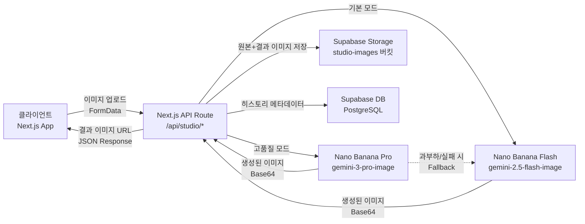
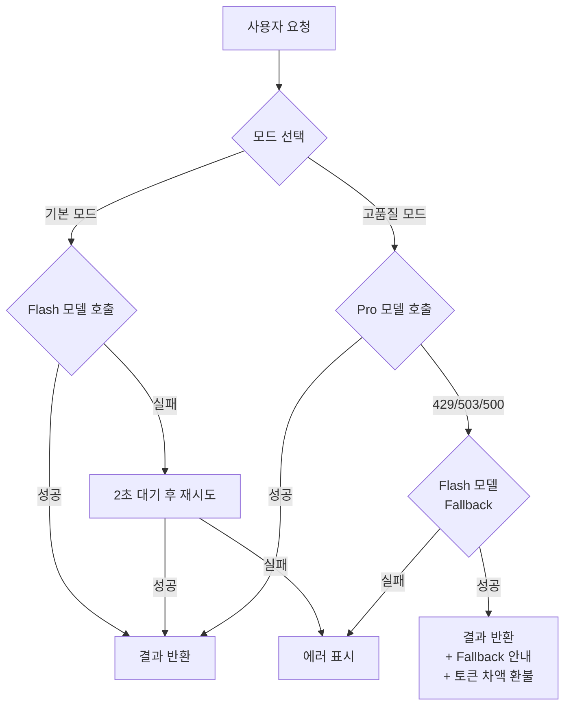

# 똑픽 MVP PRD (Product Requirements Document)

> 버전: 1.2 | 작성일: 2026-02-27 | 상태: Draft
>
> **v1.2 변경 사항**: 전체 인프라 Supabase 전환 — DB, Storage, Auth 모두 Supabase 사용. IndexedDB/NextAuth.js 제거.
> **v1.1 변경 사항**: Critical 이슈 3건 수정 — (1) localStorage → IndexedDB 전환, (2) Free Tier 불가 → Billing 필수로 변경, (3) 토큰 가격 체계 재설계 (buildupspace 참고, Flash 기본/Pro 고품질 모드 분리)

---

## 1. Executive Summary

**똑픽**은 동대문 사입 기반 중소 의류 셀러를 위한 AI 이미지 편집 B2B SaaS이다. Google Gemini API를 활용해 의류 교체(Virtual Try-On), 색상 변경(Color Swap), 포즈 변경(Pose Transfer) 3가지 핵심 기능을 제공하여, 1벌당 평균 5~15만 원의 촬영 비용과 3~5일의 제작 기간을 **건당 1,000원 이하, 수 분 이내**로 단축한다. 다품종 소량 업로드가 일상인 셀러들이 촬영 없이도 고품질 상세페이지 이미지를 자체 생산할 수 있도록 하는 것이 목표다.

---

## 2. 문제 정의 (Problem Statement)

### 현재 페인포인트

| 항목 | 현황 (추정치) |
|------|-------------|
| 1벌 촬영 비용 | 모델 촬영 5~15만 원, 평촬영 1~3만 원 |
| 촬영 소요 시간 | 스케줄 조율 포함 3~7일 |
| 색상별 추가 촬영 | 컬러당 동일 비용 반복 |
| 월 신상품 | 평균 50~200개 (동대문 사입 셀러 기준) |
| 상세페이지 외주 | 건당 3~10만 원, 수정 1~2회 추가 |

### 부재 시나리오

- **똑픽이 없다면**, 셀러는 매주 수십 벌의 신상을 일일이 촬영하거나 해외 도매 이미지를 무단 사용해 저작권 리스크를 감수해야 한다.
- **똑픽이 없다면**, 같은 옷의 5가지 색상을 보여주기 위해 5회 별도 촬영이 필요하다.
- **똑픽이 없다면**, 초기 셀러는 촬영 비용 부담으로 소량 상품만 올리게 되어 매출 성장에 한계가 생긴다.

---

## 3. 타겟 사용자 & 페르소나

### 페르소나 1: 김지영 (초기 셀러)

| 항목 | 내용 |
|------|------|
| 역할 | 스마트스토어 1인 운영, 동대문 사입 |
| 경력 | 셀러 6개월차 |
| 핵심 니즈 | 최소 비용으로 상세페이지 품질 향상 |
| 현재 워크플로우 | 도매처 이미지 그대로 사용 → 저품질, 차별화 어려움 |
| 월 업로드 | 30~50개 상품 |

### 페르소나 2: 박민수 (성장기 셀러)

| 항목 | 내용 |
|------|------|
| 역할 | 에이블리/하이버 3인 팀 운영 |
| 경력 | 셀러 2년차, 월 매출 3,000만 원 |
| 핵심 니즈 | 촬영 비용 절감 + 색상 바리에이션 효율화 |
| 현재 워크플로우 | 주 1회 스튜디오 촬영 → 포토샵 보정 → 상세페이지 제작 |
| 월 업로드 | 100~200개 상품 |

### 페르소나 3: 이서현 (상세페이지 디자이너)

| 항목 | 내용 |
|------|------|
| 역할 | 프리랜서, 다수 셀러 상세페이지 제작 대행 |
| 경력 | 디자인 5년차 |
| 핵심 니즈 | 소스 이미지 부족 문제 해결, 작업 효율 극대화 |
| 현재 워크플로우 | 셀러로부터 원본 수령 → 포토샵 편집 → 납품 |
| 월 처리량 | 200~400장 |

### 우선순위

1. **P0**: 김지영 (초기 셀러) — 가장 큰 비용 대비 효과, 진입 장벽 낮음
2. **P1**: 박민수 (성장기 셀러) — 색상 변경 기능의 핵심 사용자
3. **P2**: 이서현 (디자이너) — 배치 처리 등 고급 기능 필요, Phase 2 이후

---

## 4. MVP 범위 정의

### In Scope (Must Have)

- 의류 교체: Base 이미지 + Reference 의류 이미지 → 합성 결과물
- 색상 변경: 원본 이미지 + 색상 지정 → 의류 색상만 변경
- 포즈 변경: 원본 이미지 + 포즈 프리셋 → 포즈 변경 결과물
- 결과 이미지 다운로드 (PNG/JPG)
- 작업 히스토리 (Supabase DB 저장)
- 이미지 저장 (Supabase Storage)
- 대시보드 UI (기존 `(dashboard)` 라우트 그룹 통합)
- Supabase 인프라 세팅 (DB + Storage + RLS)

### Should Have

- 이미지 비교 뷰 (Before/After 슬라이더)
- 결과물 미세 조정 (재생성, 시드 변경)
- 포즈 프리셋 갤러리 (서있기, 앉기, 걷기 등 10종)

### Out of Scope (Won't — Phase 2에서 구현)

> 아래 기능은 MVP 메인 서비스(의류 교체, 색상 변경, 포즈 변경) 완성 후 테스트/구현 예정

- **소셜 로그인 (Phase 2)**: Supabase Auth 기반 카카오 + 구글 로그인
- **토큰 결제 시스템 (Phase 2)**: 토스 페이먼츠 API 연동, 이미지 1장당 / 화질별 토큰 소모 방식
- 배치 처리 (여러 이미지 동시 처리)
- 배경 교체/제거
- 상세페이지 템플릿 자동 생성
- 팀 협업 기능
- 모바일 앱

### MVP 성공 기준

출시 후 **4주** 내:

| 지표 | 목표 |
|------|------|
| 가입 사용자 | 100명 |
| 이미지 생성 총 건수 | 1,000건 |
| 재방문율 (7일) | 30% 이상 |
| 생성 성공률 | 85% 이상 |
| 평균 생성 시간 | 30초 이내 |

---

## 5. 기능 상세 스펙

---

### 5-A. 의류 교체 (Virtual Try-On)

#### 5.1 사용자 스토리

- 초기 셀러로서, 도매처에서 받은 옷 사진을 내 모델 사진에 입혀보고 싶다. 왜냐하면 별도 촬영 없이 자체 상세페이지를 만들고 싶기 때문이다.
- 성장기 셀러로서, 기존에 촬영한 모델 사진에 이번 시즌 신상 옷을 교체하고 싶다. 왜냐하면 매번 모델 촬영을 다시 하기에는 비용이 부담되기 때문이다.
- 디자이너로서, 클라이언트가 제공한 옷 이미지를 다양한 모델 사진에 적용해보고 싶다. 왜냐하면 여러 시안을 빠르게 만들어야 하기 때문이다.

#### 5.2 기능 요구사항

**입력**
| 항목 | 명세 |
|------|------|
| Base 이미지 | 모델 착용 사진 1장 (JPG/PNG/WebP) |
| Reference 이미지 | 교체할 의류 사진 1장 (JPG/PNG/WebP) |
| 최대 파일 크기 | 10MB per image |
| 최소 해상도 | 512×512px |
| 최대 해상도 | 4096×4096px |

**출력**
| 항목 | 명세 |
|------|------|
| 결과 이미지 | PNG (투명 배경 미지원) / JPG |
| 해상도 | 입력 Base 이미지와 동일 |
| 생성 수 | 요청당 1장 (재생성 가능) |

**처리 흐름**
1. 사용자가 Base 이미지 업로드
2. 사용자가 Reference 의류 이미지 업로드
3. 프리뷰 영역에 두 이미지 표시
4. "생성하기" 버튼 클릭
5. 로딩 상태 표시 (프로그레스 인디케이터)
6. Gemini API 호출 → 결과 수신
7. 결과 이미지 표시 (Before/After)
8. 다운로드 또는 재생성 선택

**에러 케이스**
| 에러 | 처리 |
|------|------|
| 파일 크기 초과 | 업로드 전 클라이언트 검증, toast 알림 |
| 지원하지 않는 포맷 | 업로드 전 확장자 검증 |
| 의류 영역 감지 실패 | "의류를 인식하지 못했습니다. 다른 이미지를 시도해주세요." |
| API 타임아웃 (60초) | 재시도 버튼 표시 + "잠시 후 다시 시도해주세요." |
| API Rate Limit | 큐잉 후 순차 처리, 대기 시간 표시 |

#### 5.3 UI/UX 요구사항

```
┌─────────────────────────────────────────────────┐
│  사이드바  │        의류 교체 스튜디오              │
│           │                                      │
│  ◆ 의류교체│  ┌──────────┐   ┌──────────┐        │
│  ○ 색상변경│  │ Base     │   │ Reference│        │
│  ○ 포즈변경│  │ 이미지   │   │ 이미지    │        │
│           │  │ [업로드] │   │ [업로드]  │        │
│           │  └──────────┘   └──────────┘        │
│           │                                      │
│           │        [ 생성하기 ]                   │
│           │                                      │
│           │  ┌─────────────────────────┐        │
│           │  │     결과 이미지          │        │
│           │  │   (Before ↔ After)      │        │
│           │  └─────────────────────────┘        │
│           │  [다운로드]  [재생성]                  │
└─────────────────────────────────────────────────┘
```

- 기존 `app/(dashboard)/` 레이아웃(AppSidebar) 내에 스튜디오 메뉴 추가
- 좌측 서브 네비게이션으로 3가지 기능 탭 전환
- 드래그 앤 드롭 또는 클릭 업로드 지원
- 결과물은 Before/After 슬라이더로 비교

---

### 5-B. 의류 색상 변경 (Color Swap)

#### 5.1 사용자 스토리

- 셀러로서, 검정색 원피스 사진을 베이지, 네이비, 와인 색상으로 변환하고 싶다. 왜냐하면 5가지 색상을 모두 촬영하면 비용이 5배로 늘기 때문이다.
- 셀러로서, 시즌 트렌드 색상에 맞춰 기존 촬영본의 옷 색상을 바꾸고 싶다. 왜냐하면 빠르게 트렌드에 대응해야 하기 때문이다.
- 디자이너로서, 한 벌의 촬영본으로 색상 바리에이션 전체를 만들어 납품하고 싶다. 왜냐하면 작업 시간을 절반 이하로 줄일 수 있기 때문이다.

#### 5.2 기능 요구사항

**입력**
| 항목 | 명세 |
|------|------|
| 원본 이미지 | 의류 착용 사진 1장 |
| 대상 영역 | 자동 감지 (의류 전체) 또는 클릭으로 특정 아이템 선택 |
| 목표 색상 | 컬러 피커 (HEX 입력 지원) 또는 프리셋 팔레트 |

**출력**
| 항목 | 명세 |
|------|------|
| 결과 이미지 | 해당 의류만 색상 변경된 이미지 |
| 해상도 | 원본과 동일 |

**처리 흐름**
1. 원본 이미지 업로드
2. AI가 의류 영역 자동 감지 → 하이라이트 표시
3. (선택) 사용자가 특정 의류 아이템 클릭으로 영역 수정
4. 컬러 피커로 목표 색상 선택
5. "색상 변경" 버튼 클릭
6. 결과 표시

**프리셋 팔레트** (MVP)
- 기본 12색: 블랙, 화이트, 그레이, 네이비, 베이지, 카키, 브라운, 와인, 핑크, 스카이블루, 아이보리, 차콜
- 커스텀 HEX 입력

**에러 케이스**
| 에러 | 처리 |
|------|------|
| 의류 영역 미감지 | "이미지에서 의류를 찾지 못했습니다." |
| 패턴/프린트 의류 | 경고: "패턴이 있는 의류는 결과가 다를 수 있습니다." (처리는 진행) |

#### 5.3 UI/UX 요구사항

```
┌─────────────────────────────────────────────────┐
│  사이드바  │        색상 변경 스튜디오              │
│           │                                      │
│  ○ 의류교체│  ┌────────────────┐  ┌────────────┐ │
│  ◆ 색상변경│  │ 원본 이미지     │  │ 컬러 피커  │ │
│  ○ 포즈변경│  │ (의류 영역     │  │ ○○○○○○    │ │
│           │  │  하이라이트)    │  │ ○○○○○○    │ │
│           │  │               │  │ [HEX 입력] │ │
│           │  └────────────────┘  └────────────┘ │
│           │                                      │
│           │        [ 색상 변경 ]                  │
│           │                                      │
│           │  ┌─────────────────────────┐        │
│           │  │     결과 이미지          │        │
│           │  └─────────────────────────┘        │
└─────────────────────────────────────────────────┘
```

---

### 5-C. 포즈 변경 (Pose Transfer)

#### 5.1 사용자 스토리

- 셀러로서, 서 있는 모델 사진을 앉은 포즈로 바꾸고 싶다. 왜냐하면 다양한 포즈의 사진이 상세페이지 체류 시간을 높이기 때문이다.
- 셀러로서, 정면 사진 한 장으로 측면/뒷면 포즈를 생성하고 싶다. 왜냐하면 촬영 시 미처 찍지 못한 앵글을 보충하고 싶기 때문이다.
- 디자이너로서, 클라이언트가 원하는 특정 포즈 레퍼런스에 맞춰 기존 사진을 변환하고 싶다. 왜냐하면 재촬영 없이 요청에 대응해야 하기 때문이다.

#### 5.2 기능 요구사항

**입력**
| 항목 | 명세 |
|------|------|
| 원본 이미지 | 모델 착용 사진 1장 |
| 포즈 선택 | 프리셋 갤러리 (10종) 또는 참조 포즈 이미지 업로드 |

**포즈 프리셋** (MVP 10종)
1. 정면 스탠딩 (기본)
2. 측면 스탠딩 (왼쪽)
3. 측면 스탠딩 (오른쪽)
4. 뒷면 스탠딩
5. 워킹 포즈
6. 한 손 허리
7. 양손 주머니
8. 앉은 포즈 (의자)
9. 살짝 기댄 포즈
10. 카메라 응시 (상반신)

**처리 흐름**
1. 원본 이미지 업로드
2. 포즈 프리셋 갤러리에서 선택 또는 참조 이미지 업로드
3. "포즈 변경" 버튼 클릭
4. 결과 표시

**에러 케이스**
| 에러 | 처리 |
|------|------|
| 전신이 안 보이는 이미지 | "전신이 보이는 이미지를 사용해주세요." |
| 다수 인물 | "1인 이미지만 지원합니다." |

#### 5.3 UI/UX 요구사항

```
┌─────────────────────────────────────────────────┐
│  사이드바  │        포즈 변경 스튜디오              │
│           │                                      │
│  ○ 의류교체│  ┌────────────┐  ┌────────────────┐ │
│  ○ 색상변경│  │ 원본 이미지 │  │ 포즈 프리셋    │ │
│  ◆ 포즈변경│  │            │  │ [썸네일 그리드]│ │
│           │  │            │  │ 또는           │ │
│           │  │            │  │ [이미지 업로드]│ │
│           │  └────────────┘  └────────────────┘ │
│           │                                      │
│           │        [ 포즈 변경 ]                  │
│           │                                      │
│           │  ┌─────────────────────────┐        │
│           │  │     결과 이미지          │        │
│           │  └─────────────────────────┘        │
└─────────────────────────────────────────────────┘
```

---

### 5.4 API 설계 (공통)

#### Next.js API Route 구조

```
app/api/
├── studio/
│   ├── try-on/
│   │   └── route.ts          # POST: 의류 교체
│   ├── color-swap/
│   │   └── route.ts          # POST: 색상 변경
│   └── pose-transfer/
│       └── route.ts          # POST: 포즈 변경
└── upload/
    └── route.ts              # POST: 이미지 업로드 (임시 저장)
```

#### Request/Response 스키마

```typescript
// types/studio.ts

// --- 공통 ---
interface StudioBaseRequest {
  sourceImage: string; // Base64 또는 업로드된 파일 URL
}

interface StudioBaseResponse {
  success: boolean;
  resultImageUrl?: string; // Supabase Storage 공개 URL
  resultThumbUrl?: string; // 썸네일 URL (200px)
  historyId?: string;      // Supabase DB 히스토리 레코드 ID
  modelUsed?: "gemini-2.5-flash-image" | "gemini-3-pro-image-preview";
  fallbackUsed?: boolean;  // Flash 모델로 대체되었는지 여부
  error?: string;
  processingTime?: number; // ms
}

// --- 의류 교체 ---
interface TryOnRequest extends StudioBaseRequest {
  referenceImage: string; // 교체할 의류 이미지
}

type TryOnResponse = StudioBaseResponse;

// --- 색상 변경 ---
interface ColorSwapRequest extends StudioBaseRequest {
  targetColor: string; // HEX 코드 (예: "#2C3E50")
  garmentRegion?: "auto" | "top" | "bottom" | "dress"; // 기본: auto
}

type ColorSwapResponse = StudioBaseResponse;

// --- 포즈 변경 ---
interface PoseTransferRequest extends StudioBaseRequest {
  poseType: "preset" | "custom";
  presetId?: string; // 프리셋 사용 시
  poseReferenceImage?: string; // 커스텀 포즈 이미지
}

type PoseTransferResponse = StudioBaseResponse;
```

#### 에러 핸들링 전략

```typescript
// lib/errors.ts

interface StudioError {
  code: string;
  message: string;
  retryable: boolean;
}

// 에러 코드 체계
// STUDIO_001: 이미지 포맷 미지원
// STUDIO_002: 이미지 크기 초과
// STUDIO_003: 의류 영역 감지 실패
// STUDIO_004: API 타임아웃
// STUDIO_005: Rate Limit 초과
// STUDIO_006: Gemini API 내부 오류
// STUDIO_007: 인물 감지 실패
```

- 클라이언트: Zod 스키마로 입력 사전 검증
- 서버: try-catch + 구조화된 에러 응답
- Retryable 에러(004, 005, 006)는 자동 재시도 (최대 2회, 지수 백오프)
- Non-retryable 에러(001, 002, 003, 007)는 즉시 사용자 안내

---

## 6. 기술 아키텍처

### 6.1 시스템 구성도



**이미지 저장 전략 (Supabase Storage)**
- **업로드**: 클라이언트 → FormData → API Route → Gemini API에 Base64 전달
- **원본 저장**: API Route에서 업로드된 원본 이미지를 Supabase Storage `studio-images/source/` 경로에 저장
- **결과 저장**: Gemini API 결과(Base64)를 Supabase Storage `studio-images/result/` 경로에 저장
- **썸네일**: 결과 이미지를 200px로 리사이즈하여 `studio-images/thumb/` 경로에 저장
- **URL 반환**: Supabase Storage 공개 URL을 클라이언트에 반환
- **히스토리**: 메타데이터(이미지 URL, 파라미터, 모델 정보)를 Supabase DB `studio_history` 테이블에 저장

**Storage 버킷 구조**
```
studio-images/
├── source/{session_id}/{uuid}.{ext}   # 업로드 원본
├── result/{session_id}/{uuid}.{ext}   # 생성 결과
└── thumb/{session_id}/{uuid}.{ext}    # 썸네일 (200px)
```

### 6.2 Gemini API 연동 설계

**모델 구성**

| 구분 | 모델명 | 모델 ID | 용도 |
|------|--------|---------|------|
| **기본 (Standard)** | Nano Banana (Gemini 2.5 Flash Image) | `gemini-2.5-flash-image` | 기본 모드. 빠르고 비용 효율적, 1024/2048px 지원. API 비용 $0.039/장 |
| **고품질 (Premium)** | Nano Banana Pro (Gemini 3 Pro Image) | `gemini-3-pro-image-preview` | 고품질 모드. 4K 지원, 텍스트 렌더링 우수. API 비용 $0.134~0.24/장. 사용자 선택 시 적용 |

**프롬프트 템플릿 초안**

```typescript
// lib/gemini.ts

// --- 모델 설정 ---
const GEMINI_MODELS = {
  standard: "gemini-2.5-flash-image",      // Nano Banana (Flash) — 기본 모드
  premium: "gemini-3-pro-image-preview",   // Nano Banana Pro — 고품질 모드
} as const;

type GeminiModel = (typeof GEMINI_MODELS)[keyof typeof GEMINI_MODELS];
type GenerationMode = "standard" | "premium";

// --- 모델 선택 로직 ---
async function callGeminiWithMode(
  prompt: string,
  images: string[],
  mode: GenerationMode = "standard",
): Promise<GeminiResponse> {
  const model = GEMINI_MODELS[mode];
  try {
    return await callGeminiAPI(model, prompt, images);
  } catch (error) {
    if (mode === "premium" && isOverloadOrRateLimit(error)) {
      // 고품질 모드 실패 시 → 기본 모드로 Fallback (토큰 차액 환불)
      console.warn("Premium model overloaded, falling back to Standard model");
      return await callGeminiAPI(GEMINI_MODELS.standard, prompt, images);
    }
    throw error;
  }
}

// --- 과부하 판별 ---
function isOverloadOrRateLimit(error: unknown): boolean {
  // HTTP 429 (Rate Limit), 503 (Service Unavailable), 500 (Internal Error)
  return [429, 503, 500].includes((error as any)?.status);
}
```

```typescript
// lib/prompts.ts

const PROMPTS = {
  tryOn: (context: string) =>
    `You are a fashion image editor. Replace the clothing on the person in the base image with the clothing shown in the reference image. Maintain the person's body shape, pose, skin tone, and background exactly. Ensure natural wrinkles, shadows, and fabric texture on the new clothing. ${context}`,

  colorSwap: (hexColor: string, garmentType: string) =>
    `Change only the color of the ${garmentType} in this image to ${hexColor}. Keep the fabric texture, pattern details, wrinkles, shadows, and all other elements (background, model, accessories) exactly the same. The color change should look natural and consistent across the entire garment.`,

  poseTransfer: (poseDescription: string) =>
    `Change the model's pose to: ${poseDescription}. Keep the exact same clothing, background, lighting, and model appearance. The clothing should drape naturally on the new pose. Maintain body proportions and image quality.`,
} as const;
```

**Rate Limiting / 비용 최적화**
- Nano Banana Pro: RPM/RPD 제한 확인 후 설정 (프리뷰 모델 기준)
- Nano Banana Flash: Pro 대비 높은 처리량, 비용 절감 효과
- MVP 초기: Google Cloud Billing 활성화 필수 (Free Tier에서 이미지 생성 불가, 2025.12 정책 변경). 일일/월간 예산 알림 설정으로 비용 통제. 개발/테스트 예산 추정: Flash 1,000회 ≈ $39(약 57,000원), Pro 1,000회 ≈ $134(약 196,000원)
- 클라이언트 측 디바운싱: 연속 클릭 방지 (3초 쿨다운)
- 이미지 리사이즈: 클라이언트에서 최대 2048px로 다운스케일 후 전송 (Pro는 4K 지원하나 비용 최적화 위해)

**Fallback 전략**



- **고품질 → 기본 Fallback 조건**: HTTP 429 (Rate Limit), 503 (Service Unavailable), 500 (Internal Error)
- **Fallback 안내**: 고품질 모드에서 Fallback 발생 시 toast로 "기본 모델로 생성되었습니다. 토큰 차액이 환불됩니다." 표시
- **토큰 차액 환불**: 고품질 모드 요청 → Flash Fallback 시, (고품질 토큰 - 기본 토큰) 차액 자동 환불
- **모델 사용 로깅**: 어떤 모델로 생성했는지 히스토리에 기록 (`modelUsed` 필드)

### 6.3 프론트엔드 구조

```
app/(dashboard)/studio/
├── page.tsx                    # 스튜디오 메인 (의류 교체 기본)
├── color-swap/
│   └── page.tsx                # 색상 변경
└── pose-transfer/
    └── page.tsx                # 포즈 변경

components/studio/
├── image-upload-zone.tsx       # 드래그앤드롭 이미지 업로드
├── image-preview.tsx           # 이미지 프리뷰 (Before/After)
├── result-viewer.tsx           # 결과 이미지 뷰어 + 다운로드
├── color-picker.tsx            # 컬러 피커 + 프리셋 팔레트
├── pose-preset-gallery.tsx     # 포즈 프리셋 썸네일 그리드
├── processing-indicator.tsx    # 생성 중 로딩 상태
└── studio-sidebar-nav.tsx      # 스튜디오 내 서브 네비게이션

lib/
├── gemini.ts                   # Gemini API 클라이언트 래퍼
├── image-utils.ts              # 이미지 리사이즈, Base64 변환 등
└── supabase/
    ├── client.ts               # Supabase 브라우저 클라이언트 (createBrowserClient)
    ├── server.ts               # Supabase 서버 클라이언트 (createServerClient)
    └── middleware.ts            # Supabase Auth 세션 갱신 미들웨어

config/studio.ts                # 스튜디오 설정 (프리셋 색상, 포즈 목록 등)
types/studio.ts                 # 스튜디오 관련 타입 정의

# --- Phase 2에서 추가 예정 ---
app/(auth)/
├── login/page.tsx              # 카카오/구글 소셜 로그인 (Supabase Auth)
├── signup/page.tsx             # 회원가입 (소셜 연동)
└── callback/route.ts           # Supabase Auth OAuth 콜백

app/(dashboard)/tokens/
└── page.tsx                    # 토큰 충전 / 사용 내역

app/api/
├── payments/
│   ├── confirm/route.ts        # 토스 결제 승인
│   └── webhook/route.ts        # 토스 웹훅 (결제 상태 변경)
└── tokens/
    └── route.ts                # GET: 잔액 조회, POST: 토큰 차감

lib/toss.ts                     # 토스 페이먼츠 API 클라이언트
config/pricing.ts               # 토큰 패키지, 기능별 소모량 설정
types/payment.ts                # 결제/토큰 관련 타입
```

**상태 관리**
- 이미지 업로드/결과: React `useState` (컴포넌트 로컬)
- 처리 상태: `"idle" | "uploading" | "processing" | "success" | "error"`
- 히스토리: Supabase DB + 커스텀 훅 `useStudioHistory()` (서버 컴포넌트에서 직접 조회 또는 클라이언트에서 `@supabase/ssr` 사용)
- 인증 상태: Supabase Auth 세션 (Phase 2)
- 글로벌 상태 관리 라이브러리 불필요 (MVP 범위에서는 props drilling으로 충분)

### 6.4 데이터 모델

**Supabase DB 스키마 (Phase 1 — MVP)**

```sql
-- supabase/migrations/001_studio_history.sql

-- 스튜디오 작업 히스토리
create table studio_history (
  id uuid default gen_random_uuid() primary key,
  session_id text not null,                -- 비로그인 사용자 식별 (쿠키 기반 UUID)
  user_id uuid references auth.users,      -- Phase 2에서 로그인 사용자 연결
  created_at timestamptz default now(),
  type text not null check (type in ('try-on', 'color-swap', 'pose-transfer')),
  mode text not null check (mode in ('standard', 'premium')),
  source_image_url text not null,          -- Supabase Storage URL
  result_image_url text not null,          -- Supabase Storage URL
  source_thumb_url text,                   -- 썸네일 URL (200px)
  result_thumb_url text,                   -- 썸네일 URL (200px)
  params jsonb not null,                   -- 요청 파라미터 (JSON)
  model_used text not null,
  fallback_used boolean default false,
  processing_time integer                  -- ms
);

-- 세션 기반 조회 인덱스
create index idx_studio_history_session on studio_history(session_id, created_at desc);

-- RLS 정책 (MVP: session_id 기반 접근)
alter table studio_history enable row level security;

create policy "Session can view own history"
  on studio_history for select
  using (session_id = current_setting('request.headers')::json->>'x-session-id');

create policy "API can insert history"
  on studio_history for insert
  with check (true);  -- API Route(서버)에서 service_role로 삽입

-- Supabase Storage 버킷
-- studio-images: 공개 읽기, 인증된 쓰기 (service_role)
```

**Supabase DB 스키마 (Phase 2 — 인증 & 토큰)**

```sql
-- supabase/migrations/002_users_and_tokens.sql

-- 사용자 프로필 (Supabase Auth 확장)
create table profiles (
  id uuid references auth.users on delete cascade primary key,
  email text,
  name text,
  avatar_url text,
  provider text,                           -- 'kakao' | 'google'
  token_balance integer default 30,        -- 무료 체험 30토큰
  created_at timestamptz default now()
);

-- 신규 가입 시 자동 프로필 생성 트리거
create or replace function handle_new_user()
returns trigger as $$
begin
  insert into profiles (id, email, name, avatar_url, provider)
  values (
    new.id,
    new.email,
    coalesce(new.raw_user_meta_data->>'name', new.raw_user_meta_data->>'full_name'),
    new.raw_user_meta_data->>'avatar_url',
    new.raw_app_meta_data->>'provider'
  );
  return new;
end;
$$ language plpgsql security definer;

create trigger on_auth_user_created
  after insert on auth.users
  for each row execute function handle_new_user();

-- 토큰 거래 내역
create table token_transactions (
  id uuid default gen_random_uuid() primary key,
  user_id uuid references profiles(id) on delete cascade not null,
  type text not null check (type in ('charge', 'consume', 'bonus')),
  amount integer not null,                 -- 양수(충전), 음수(소모)
  balance_after integer not null,          -- 거래 후 잔액
  reason text,                             -- 'try-on:1024px:standard', 'package:pro' 등
  toss_payment_key text,                   -- 충전 시 토스 결제 키
  created_at timestamptz default now()
);

create index idx_token_tx_user on token_transactions(user_id, created_at desc);

-- Phase 2 RLS 정책
alter table profiles enable row level security;
alter table token_transactions enable row level security;

create policy "Users can view own profile"
  on profiles for select using (auth.uid() = id);

create policy "Users can update own profile"
  on profiles for update using (auth.uid() = id);

create policy "Users can view own transactions"
  on token_transactions for select using (auth.uid() = user_id);

-- Phase 2: studio_history에 user_id 연결
-- 로그인 시 session_id → user_id 마이그레이션
create or replace function link_session_to_user(p_session_id text, p_user_id uuid)
returns void as $$
begin
  update studio_history
  set user_id = p_user_id
  where session_id = p_session_id and user_id is null;
end;
$$ language plpgsql security definer;
```

**TypeScript 타입 정의**

```typescript
// types/studio.ts

interface StudioHistoryItem {
  id: string;                    // UUID (Supabase auto-generated)
  sessionId: string;             // 비로그인 세션 식별자
  userId?: string;               // Phase 2: 로그인 사용자 ID
  createdAt: string;             // ISO 8601
  type: "try-on" | "color-swap" | "pose-transfer";
  mode: "standard" | "premium";
  sourceImageUrl: string;        // Supabase Storage URL
  resultImageUrl: string;        // Supabase Storage URL
  sourceThumbUrl?: string;       // 썸네일 URL
  resultThumbUrl?: string;       // 썸네일 URL
  params: TryOnRequest | ColorSwapRequest | PoseTransferRequest;
  modelUsed: "gemini-2.5-flash-image" | "gemini-3-pro-image-preview";
  fallbackUsed: boolean;
  processingTime: number;        // ms
}
```

```typescript
// types/payment.ts (Phase 2)

interface Profile {
  id: string;                    // Supabase Auth user ID
  email: string;
  name: string;
  avatarUrl?: string;
  provider: "kakao" | "google";
  tokenBalance: number;
  createdAt: string;
}

interface TokenTransaction {
  id: string;
  userId: string;
  type: "charge" | "consume" | "bonus";
  amount: number;
  balanceAfter: number;
  reason?: string;
  tossPaymentKey?: string;
  createdAt: string;
}

interface TokenPackage {
  id: string;
  name: string;                  // "라이트", "프로", "맥스"
  tokens: number;
  price: number;                 // 원
  bonusTokens?: number;
  recommended?: boolean;
}
```

```typescript
// config/pricing.ts

// 토큰 소모량 — 모드별 차등 (Flash 기본, Pro 고품질)
const TOKEN_COST = {
  // 기본 모드 (Flash 모델 — 빠르고 경제적)
  standard: {
    "try-on":        { "1024": 10, "2048": 15 },
    "color-swap":    { "1024": 8,  "2048": 12 },
    "pose-transfer": { "1024": 10, "2048": 15 },
  },
  // 고품질 모드 (Pro 모델 — 4K 지원, 높은 품질)
  premium: {
    "try-on":        { "1024": 20, "2048": 30, "4096": 40 },
    "color-swap":    { "1024": 16, "2048": 24, "4096": 35 },
    "pose-transfer": { "1024": 20, "2048": 30, "4096": 40 },
  },
} as const;

// 토큰 패키지 (buildupspace 가격대 참고)
const TOKEN_PACKAGES: TokenPackage[] = [
  { id: "lite", name: "라이트", tokens: 150,  price: 11000 },
  { id: "pro",  name: "프로",   tokens: 500,  price: 35000, bonusTokens: 50, recommended: true },
  { id: "max",  name: "맥스",   tokens: 1500, price: 99000, bonusTokens: 150 },
];

// 토큰당 단가: 라이트 73.3원, 프로 63.6원, 맥스 60원
// 기본 모드 1회 생성 비용: 600~733원 (Flash API 비용 $0.039=57원 → 마진 88~92%)
// 고품질 모드 1회 생성 비용: 1,200~1,467원 (Pro API 비용 $0.134=196원 → 마진 83~87%)

const FREE_TRIAL_TOKENS = 30; // 신규 가입 시 무료 토큰 (기본 모드 3회 체험 가능)
```

**Supabase 프로젝트 구성**
- **DB**: PostgreSQL — `studio_history`, `profiles`, `token_transactions` 테이블
- **Storage**: `studio-images` 버킷 — 공개 읽기, service_role 쓰기
- **Auth**: Phase 2에서 카카오/구글 OAuth Provider 활성화 (Supabase 대시보드에서 설정)
- **RLS**: 모든 테이블에 Row Level Security 적용
- **Edge Functions**: 필요 시 토큰 차감 등 서버 로직에 활용 (선택적)

---

## 7. 개발 운영 환경 (DevOps & Hooks)

### 기존 Claude Code Hooks

| Hook | 트리거 | 동작 |
|------|--------|------|
| SessionStart | 세션 시작 | `.env.local`에서 `SLACK_WEBHOOK_URL` 로드 |
| Notification | 권한 요청 | Slack `#starter-kit-noti` 알림 |
| Stop | 작업 완료 | Slack 완료 알림 |
| PreToolUse | `git commit` | `npm run lint` + `npm run build` 검증 |

### 스튜디오 추가 시 확장 계획

- **SessionStart 확장**: `GEMINI_API_KEY`, `NEXT_PUBLIC_SUPABASE_URL`, `NEXT_PUBLIC_SUPABASE_ANON_KEY` 환경변수 존재 여부 검증 추가
- **PreToolUse 확장**: API Route 파일 변경 시 타입 체크 강화
- **향후**: 이미지 생성 완료 시 Slack 알림 (운영 모니터링용)

### 환경변수 관리

```bash
# .env.local

# --- 기존 ---
SLACK_WEBHOOK_URL=https://hooks.slack.com/services/...

# --- Supabase (Phase 1부터 사용) ---
NEXT_PUBLIC_SUPABASE_URL=https://xxx.supabase.co         # 클라이언트+서버 공용
NEXT_PUBLIC_SUPABASE_ANON_KEY=eyJ...                     # 클라이언트+서버 공용 (RLS로 보호)
SUPABASE_SERVICE_ROLE_KEY=eyJ...                         # 서버 전용 (RLS 우회, Storage 쓰기)

# --- Gemini (Phase 1부터 사용) ---
GEMINI_API_KEY=AIza...                                   # 서버 전용

# --- Phase 2에서 추가 예정 ---
# 카카오/구글 OAuth → Supabase 대시보드 Authentication > Providers에서 설정
# (앱 코드에 OAuth 키 불필요 — Supabase가 서버 측에서 처리)
NEXT_PUBLIC_TOSS_CLIENT_KEY=...                          # 토스 페이먼츠 (클라이언트 위젯용)
TOSS_SECRET_KEY=...                                      # 토스 페이먼츠 (서버 전용)
```

- `SUPABASE_SERVICE_ROLE_KEY`, `GEMINI_API_KEY`, `TOSS_SECRET_KEY`: 서버 사이드 전용. `NEXT_PUBLIC_` 접두사 절대 금지
- `NEXT_PUBLIC_SUPABASE_URL`, `NEXT_PUBLIC_SUPABASE_ANON_KEY`: 클라이언트 노출 가능 (RLS가 데이터 보호)
- 카카오/구글 OAuth 키: Supabase 대시보드에서 직접 관리 (앱 코드에 불필요)
- `.env.local`은 `.gitignore`에 포함 확인
- `.env.example`에 키 이름만 기재 (값 없이)

### CI/CD 고려

- PreToolUse Hook의 lint + build 검증과 GitHub Actions CI를 동일 명령으로 유지
- 환경변수는 Vercel/배포 플랫폼의 Environment Variables에 별도 설정

---

## 8. 비기능 요구사항

| 항목 | 요구사항 |
|------|---------|
| **성능** | 이미지 생성 응답 30초 이내 (Gemini API 응답 포함). 업로드 프리뷰 1초 이내. |
| **보안** | API 키(`GEMINI_API_KEY`, `SUPABASE_SERVICE_ROLE_KEY`) 서버 사이드 전용. Supabase RLS로 데이터 접근 제어. HTTPS 필수. |
| **확장성** | MVP에서는 Gemini Tier 1 RPM/RPD 제한이 자연스러운 제한 역할. Google Cloud Billing 일일/월간 예산 알림으로 비용 통제. 향후 Redis 큐 도입. |
| **접근성** | 이미지 업로드 영역 키보드 접근 가능. 로딩 상태 aria-live 안내. 색상 대비 WCAG 2.1 AA. |
| **브라우저** | Chrome, Safari, Edge 최신 2개 버전. 모바일 웹 반응형 지원 (편집은 데스크톱 권장). |
| **용량** | 클라이언트 메모리: 동시 이미지 3장까지 Base64 유지. 히스토리 Supabase DB 저장 (세션당 50건 FIFO). 이미지 Supabase Storage 저장 (용량 제한 없음). |

---

## 9. 릴리스 계획

### Phase 1 — MVP (4주)

| 주차 | 범위 |
|------|------|
| 1주 | 프로젝트 세팅: Supabase 프로젝트 생성 (DB + Storage + RLS), API Route 구조, Gemini 연동 |
| 2주 | 이미지 업로드 컴포넌트 + 의류 교체 기능 완성 (프롬프트 튜닝 포함) |
| 3주 | 색상 변경 + 포즈 변경 기능 완성 |
| 4주 | UI 폴리싱, 에러 핸들링, Before/After 뷰, 히스토리 (Supabase DB 조회) |

**산출물**: 대시보드 내 스튜디오 3개 기능 동작, Supabase 인프라 구축 완료, 무인증 사용 가능 (세션 기반)

### Phase 2 — 인증 & 토큰 결제 (4주)

> MVP 메인 서비스 완성 후 진행. 먼저 로그인 → 결제 순서로 테스트.

#### 2-A. 소셜 로그인 (1~2주차)
- **카카오 로그인**: Supabase Auth → Kakao OAuth Provider 활성화
- **구글 로그인**: Supabase Auth → Google OAuth Provider 활성화
- Supabase Auth 기반 세션 관리 (`@supabase/ssr` + 미들웨어)
- `app/(auth)/` 라우트 그룹에 로그인/회원가입 UI 연동
- `app/(auth)/callback/route.ts`에 OAuth 콜백 처리
- 사용자 프로필 자동 생성 (DB 트리거 → `profiles` 테이블)
- 기존 세션 데이터(session_id)를 로그인 사용자(user_id)에 연결 (마이그레이션 함수)

#### 2-B. 토큰 결제 시스템 (3~4주차)
- **결제 수단**: 토스 페이먼츠 API (TossPayments)
- **과금 모델**: 토큰 기반 선불 충전 (buildupspace 가격대 참고)
  - 계정 생성 시 무료 체험 토큰 부여: 30토큰 (기본 모드 3회 체험 가능)
  - 토큰 패키지 구매:
    - 라이트: 150토큰 / 11,000원 (73.3원/토큰)
    - 프로: 550토큰(500+50보너스) / 35,000원 (63.6원/토큰) — **추천**
    - 맥스: 1,650토큰(1,500+150보너스) / 99,000원 (60원/토큰)
- **모델 선택**: 기본 모드(Flash) / 고품질 모드(Pro) 사용자 선택
- **토큰 소모 기준**:

  **기본 모드 (Flash 모델 — 빠르고 경제적)**

  | 작업 | 일반 (1024px) | 고화질 (2048px) |
  |------|-------------|---------------|
  | 의류 교체 | 10토큰 | 15토큰 |
  | 색상 변경 | 8토큰 | 12토큰 |
  | 포즈 변경 | 10토큰 | 15토큰 |

  **고품질 모드 (Pro 모델 — 4K 지원)**

  | 작업 | 일반 (1024px) | 고화질 (2048px) | 최고 화질 (4K) |
  |------|-------------|---------------|---------------|
  | 의류 교체 | 20토큰 | 30토큰 | 40토큰 |
  | 색상 변경 | 16토큰 | 24토큰 | 35토큰 |
  | 포즈 변경 | 20토큰 | 30토큰 | 40토큰 |

  > 고품질 모드에서 Fallback(Flash) 발생 시, 기본 모드와의 토큰 차액 자동 환불

- 토큰 잔액 실시간 표시 (헤더 영역)
- 토큰 부족 시 충전 유도 모달
- 토큰 사용 내역 조회

#### 2-C. 기타
- Supabase RLS 정책 강화 (user_id 기반 접근 제어로 전환)
- 사용량 추적 대시보드
- 프롬프트 최적화 (성공률 90%+ 목표)

### Phase 3 — 확장 (6주)

- 배치 처리 (최대 10장 동시)
- 상세페이지 템플릿 자동 생성
- 구독 플랜 (월정액 무제한 등)
- 배경 교체/제거 기능
- 팀 협업 (워크스페이스)

---

## 10. 리스크 & 완화 전략

| 리스크 | 영향도 | 발생 가능성 | 완화 전략 |
|--------|--------|------------|----------|
| Nano Banana Pro 이미지 편집 품질이 기대 이하 | 높음 | 중간 | 프롬프트 A/B 테스트 + 모델 업데이트 추적. 최후 수단으로 DALL-E, Stable Diffusion 대안 조사 |
| API 응답 지연 (30초 초과) | 중간 | 중간 | 이미지 사전 리사이즈 + Pro 지연 시 Flash 자동 전환으로 응답 시간 확보 |
| Nano Banana Pro Rate Limit / 과부하 | 높음 | 높음 | Nano Banana Flash 자동 Fallback + 사용량 모니터링 + 유료 플랜 전환 기준 사전 설정 |
| Flash Fallback 품질 저하 | 중간 | 중간 | Fallback 사용 시 사용자에게 명시 안내 + 재생성(Pro) 버튼 제공 |
| 생성 이미지 저작권 이슈 | 높음 | 낮음 | 이용약관에 AI 생성물 명시, 사용자 업로드 이미지 권리 확인 동의 절차 |
| 인물 초상권/개인정보 | 높음 | 중간 | 업로드 시 "본인 또는 사용 허가를 받은 이미지입니다" 동의 체크박스 |
| 경쟁 서비스 출현 (Klingai, 패션AI 등) | 중간 | 높음 | 동대문 셀러 특화 UX, 한국어 최적화로 차별화 |
| 부적절한 이미지 생성 | 중간 | 낮음 | Gemini API 내장 안전 필터 활용 + 출력 검증 로직 |
| 토스 결제 연동 장애 (Phase 2) | 높음 | 낮음 | 토스 테스트 모드로 충분한 사전 테스트 + 결제 실패 시 토큰 미차감 보장 |
| 토큰 가격 정책 미스매치 (Phase 2) | 중간 | 중간 | 베타 기간 무료/저가 운영 후 사용 데이터 기반 가격 조정 |
| Supabase Auth OAuth 장애 (Phase 2) | 중간 | 낮음 | 카카오/구글 이중 제공으로 한쪽 장애 시 다른 수단 안내. Supabase 상태 페이지 모니터링 |

---

## 11. 성공 지표 (KPIs)

### 제품 지표

| 지표 | 측정 방법 | 목표 (MVP 4주) |
|------|----------|---------------|
| DAU | 일일 스튜디오 페이지 방문 사용자 | 30명 |
| 이미지 생성 건수 | API 호출 성공 횟수 | 1,000건 (누적) |
| 기능별 사용 비율 | 기능별 API 호출 비율 | 의류교체 50%, 색상변경 30%, 포즈변경 20% |
| 세션당 생성 수 | 1회 방문당 평균 생성 횟수 | 3건 이상 |

### 품질 지표

| 지표 | 측정 방법 | 목표 |
|------|----------|------|
| 생성 성공률 | 성공 응답 / 전체 요청 | 85% 이상 |
| 다운로드율 | 다운로드 / 성공 생성 | 60% 이상 (결과물 만족도 대리 지표) |
| 재생성율 | 재생성 클릭 / 성공 생성 | 40% 이하 (낮을수록 좋음) |
| 평균 응답 시간 | API 호출 ~ 결과 수신 | 30초 이내 |

### 비즈니스 지표

| 지표 | 측정 방법 | 목표 |
|------|----------|------|
| 재방문율 (7일) | 7일 내 재방문 사용자 / 전체 | 30% 이상 |
| 추정 비용 절감 | (촬영 비용 - API 비용) × 생성 건수 | 사용자당 월 50만 원 이상 절감 |
| NPS | 인앱 설문 (Phase 2) | 40 이상 |

### Phase 2 지표 (인증 & 결제)

| 지표 | 측정 방법 | 목표 |
|------|----------|------|
| 가입 전환율 | 가입 완료 / 랜딩 방문 | 15% 이상 |
| 유료 전환율 | 첫 결제 사용자 / 가입 사용자 | 5% 이상 |
| 평균 토큰 충전액 | 월 충전 총액 / 유료 사용자 수 | 15,000원 이상 |
| 토큰 소진율 | 소모 토큰 / 충전 토큰 | 70% 이상 (높을수록 활성 사용) |
| 무료 체험 → 유료 전환 | 무료 토큰 소진 후 충전 사용자 비율 | 10% 이상 |
