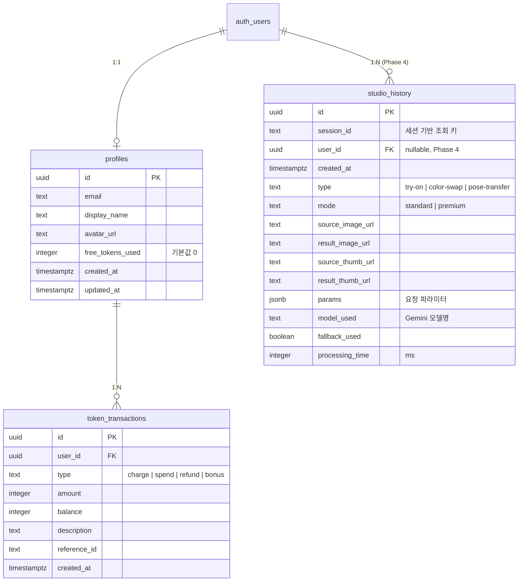

# 똑픽 데이터베이스 스키마

## ERD



## 테이블 설명

### studio_history

스튜디오 이미지 생성 작업 기록. Phase 1에서는 `session_id` 기반으로 조회하며, Phase 4에서 `user_id`와 연결.

| 컬럼             | 타입    | 설명                              |
| ---------------- | ------- | --------------------------------- |
| id               | uuid    | PK, auto-generated                |
| session_id       | text    | 브라우저 세션 ID                  |
| user_id          | uuid    | FK → auth.users (nullable)        |
| type             | text    | try-on, color-swap, pose-transfer |
| mode             | text    | standard, premium                 |
| source_image_url | text    | 원본 이미지 Storage URL           |
| result_image_url | text    | 결과 이미지 Storage URL           |
| params           | jsonb   | 요청 파라미터 (타입별 상이)       |
| model_used       | text    | 사용된 Gemini 모델                |
| fallback_used    | boolean | Flash→Pro 폴백 발생 여부          |
| processing_time  | integer | 처리 시간 (ms)                    |

### profiles (Phase 4)

Supabase Auth 사용자 프로필. `on_auth_user_created` 트리거로 자동 생성.

### token_transactions (Phase 4)

토큰 충전/사용/환불/보너스 거래 내역.

## RLS 정책 요약

| 테이블             | 정책          | 조건                                      |
| ------------------ | ------------- | ----------------------------------------- |
| studio_history     | SELECT        | `session_id` = 요청 헤더의 `x-session-id` |
| studio_history     | INSERT        | service_role (무조건 허용)                |
| profiles           | SELECT/UPDATE | `auth.uid() = id`                         |
| token_transactions | SELECT        | `auth.uid() = user_id`                    |

## Storage 버킷

**studio-images** (public)

```
studio-images/
├── source/     ← 원본 이미지
├── result/     ← 생성 결과 이미지
└── thumb/      ← 썸네일 (256x256)
```

- 읽기: 공개 (CDN 캐싱)
- 쓰기: service_role만 (API Route에서 업로드)
